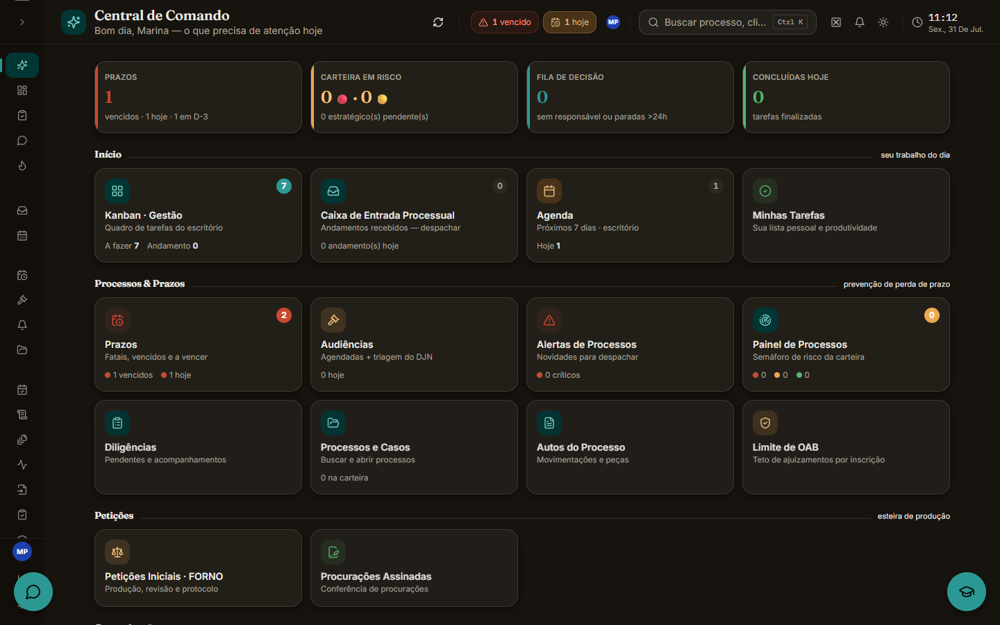

# Roteiro de captura — prints e gifs dos projetos

O terreno já está pronto no HTML. Cada slot de mídia existe vazio (mostrando a
retícula) e reserva o espaço em 16:9, então **publicar uma captura é colar uma
linha dentro do `<figure class="shot">` correspondente** — nada de trocar classe
ou mexer em CSS.

## Como publicar uma captura

Print:

```html

```

Gif (grave e **converta para mp4** — 10s de gif costuma pesar 8 MB, o mesmo em
mp4 pesa 400 KB):

```html
<video src="assets/shots/jvb-lead.mp4" width="1440" height="810"
       autoplay muted loop playsinline
       aria-label="Mensagem no WhatsApp virando lead e card no funil."></video>
```

`ffmpeg -i entrada.mov -vf "scale=1440:-2,fps=24" -an -crf 30 saida.mp4`

O slot já dessatura a mídia (o site é de 1 bit) e devolve a cor no hover. Não
precisa editar a imagem pra "combinar" com o site.

## Regras de qualidade

- Tela cheia, 1440px ou mais, **sem barra do navegador**.
- Nada de moldura de MacBook. O produto sozinho é mais forte.
- Uma legenda por captura, uma frase, dizendo **o que olhar**
  ("repare no prazo prorrogado automaticamente para o dia útil seguinte").
- Sempre preencher `width`/`height` reais: sem eles a página pula quando a
  imagem carrega.
- `alt` descreve o que a captura mostra, não "print do sistema".

## Sigilo — obrigatório antes de qualquer print do JVB

Crie um conjunto de dados fictícios coerente ("Maria Oliveira Santos", CNJs
fictícios com dígito válido, conversas escritas por você) e tire **todos** os
prints dele. Borrar é pior que substituir: tarja preta parece vazamento contido,
dado fictício coerente parece produto.

- [ ] Autorização por escrito do cliente, guardada
- [ ] Nenhum nome real de pessoa física
- [ ] Nenhum CPF, CNPJ, OAB, telefone, e-mail ou endereço real
- [ ] Nenhum número CNJ real
- [ ] Nenhum valor de causa ou honorário real
- [ ] Nenhum texto real de peça, decisão ou conversa
- [ ] Nenhum token, URL interna, ID de banco ou stack trace visível

---

## Lista de captura

### 01 · JVB — ERP jurídico (`projeto-jvb.html`)

| Arquivo | Tela | O que prova |
| --- | --- | --- |
| `jvb-painel.png` | Painel do dia | Que é um sistema, não uma tela |
| `jvb-processos.png` | Kanban de processos | Densidade de informação e domínio |
| `jvb-prazos.png` | Agenda de prazos | O motor do CPC em uso — **mostre um prazo prorrogado**, conta a história sozinho |
| `jvb-peticao.png` | Editor de petição com IA | IA aplicada, não IA de demo |
| `jvb-permissoes.png` | Permissões e auditoria | Que você pensou em segurança, não só em feature |

### 02 · Triagem por IA no WhatsApp (`projeto-triagem.html`)

| Arquivo | Tela | O que prova |
| --- | --- | --- |
| `triagem-conversa.png` | Conversa integrada ao sistema | A integração que é o diferencial. **Print mais sensível: conversa 100% fabricada** |
| `triagem-lead.mp4` | Mensagem → lead → card no funil | O maior retorno da lista inteira. Nenhum print captura isso |
| `triagem-handoff.png` | Advogado assume e o bot pausa | O guardrail existindo na prática |

### 03 · Gesture AI Desk

| Arquivo | Tela | O que prova |
| --- | --- | --- |
| `gesture-demo.mp4` | Sua mão controlando a tela, webcam visível no canto | Que funciona de verdade. Aqui o vídeo **é** o projeto |
| `gesture-landmarks.png` | Os 21 pontos desenhados sobre a mão | O que o sistema enxerga |

### 04 · dev-tools

| Arquivo | Tela | O que prova |
| --- | --- | --- |
| `devtools-dash.png` | Dashboard com as 15 ferramentas | Escopo |
| `devtools-uso.mp4` | Uma ferramenta ponta a ponta (OCR ou remoção de fundo) | Que é usável, não vitrine |

### 05 · seamless-ai-dub

| Arquivo | Tela | O que prova |
| --- | --- | --- |
| `dub-antes-depois.mp4` | Mesmo trecho em inglês e depois dublado | Só o áudio prova esse projeto |
| `dub-gradio.png` | A interface Gradio processando | O pipeline rodando |

### 06 · SOMS

| Arquivo | Tela | O que prova |
| --- | --- | --- |
| `soms-partida.mp4` | Rodada com várias pessoas, palpites entrando ao vivo | Realtime é movimento, print não mostra |
| `soms-stats.png` | Card de estatística do fim da partida | O acabamento do produto |

### 07 · SUS

| Arquivo | Tela | O que prova |
| --- | --- | --- |
| `sus-votacao.mp4` | A votação e a revelação do impostor | O momento do jogo |
| `sus-sala.png` | Sala com jogadores conectados | Multiplayer de verdade |

### 08 · POV

| Arquivo | Tela | O que prova |
| --- | --- | --- |
| `pov-1.mp4` | *(definir quando o case for escrito)* | — |
